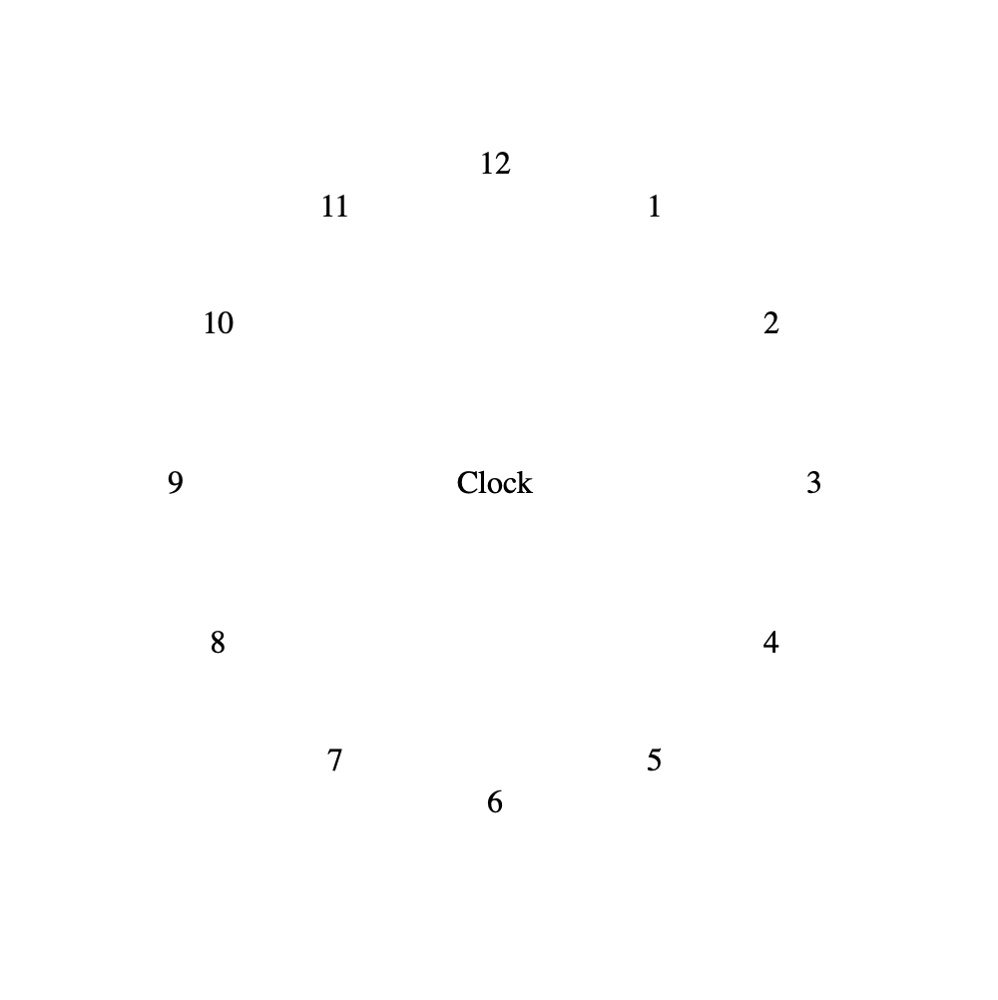

# CircularJS

> Quickly create circular layout with absolute positioning and transformations

## How To Use

### Circular Container
When you need a container to specify default radius or position circular items with order attribute, give the container `circular-container` class.  

Elements with `circular-container` class will get relative positioning property.  

Default radius can be specified in container in the same way as specified in items (see below).

### Circular Item

##### Circular Item (at center)  
When you need an item at container's center, give the element `circular-center` class  
*`data-angle`, `data-order`, `data-radius` has no effect for centered elements.*

##### Circular Item (not at center)
When you need an item at outer sphere, give the element `circular-item` class 

###### Radius
Specify the **radius** with `data-radius=<length>` [data attribute](https://developer.mozilla.org/en-US/docs/Learn/HTML/Howto/Use_data_attributes) which decides how far the element center distanced from the center, where [length](https://developer.mozilla.org/en-US/docs/Web/CSS/length) represents a distance value.  
      
  The **radius** property will be used to generate a translation between rotations (see [translate()](https://developer.mozilla.org/en-US/docs/Web/CSS/transform-function/translate)).  
  
  Here are some examples:
  + `0`
  + `10px`
  + `5rem`

###### Angle

+ Specify the **angle** the element center deviated clockwisely from the top (*above*) direction with `data-degree=<angle>` [data attribute](https://developer.mozilla.org/en-US/docs/Learn/HTML/Howto/Use_data_attributes), where [angle](https://developer.mozilla.org/en-US/docs/Web/CSS/angle) represents an angle value expressed in degrees, gradians, radians, or turns.  

    The **angle** property will be used to generate a rotation before and a reverse rotation after translation (see [rotate()](https://developer.mozilla.org/en-US/docs/Web/CSS/transform-function/rotate)).  
      
      Here are some examples:  
      
      + `0`
      + `270`
      + `π`
      + `0deg`
      + `0grad`
      + `-2πrad`
      + `2πrad`
      + `1.2turn`

+ Specify the **angle** with `data-order=<number>` [data attribute](https://developer.mozilla.org/en-US/docs/Learn/HTML/Howto/Use_data_attributes), where [number](https://developer.mozilla.org/en-US/docs/Web/CSS/number) represents a positional order, each element equaldistant from each other in circumsference.

  Think the elements with positive order number as being ranked from smallest to largest: the element with smallest positive order will be clockwisely closest to the top (*above*) direction while the element with largest positive order will be clockwisely farthest from the top direction.  
  On the other hand, elements with negative order number are ranked from largest to smallest, the element with largest negative order will be counterclockwisely closest (clockwisely fartheset) to the top direction while the element with the smallest negative order will be counterclockwisely farthest (clockwisely closest) from the top direcion.
  
  It might be easier to learn by example:
  
  ```html
      <div class="circular-container" data-radius="10rem" style="height:500px">
        <p class="circular-center">
            Clock
        </p>
        <p class="circular-item" data-order="1">
            1
        </p>
        <p class="circular-item" data-order="2">
            2
        </p>
        <p class="circular-item" data-order="3">
            3
        </p>
        <p class="circular-item" data-order="4">
            4
        </p>
        <p class="circular-item" data-order="5">
            5
        </p>
        <p class="circular-item" data-order="6">
            6
        </p>
        <p class="circular-item" data-order="7">
            7
        </p>
        <p class="circular-item" data-order="8">
            8
        </p>
        <p class="circular-item" data-order="9">
            9
        </p>
        <p class="circular-item" data-order="10">
            10
        </p>
        <p class="circular-item" data-order="11">
            11
        </p>
        <p class="circular-item" data-order="0">
            12
        </p>
    </div>
  ```
  ```html
      <div class="circular-container" data-radius="10rem" style="height:500px">
        <p class="circular-center">
            Clock
        </p>
        <p class="circular-item" data-order="1">
            1
        </p>
        <p class="circular-item" data-order="2">
            2
        </p>
        <p class="circular-item" data-order="3">
            3
        </p>
        <p class="circular-item" data-order="4">
            4
        </p>
        <p class="circular-item" data-order="5">
            5
        </p>
        <p class="circular-item" data-order="-6">
            6
        </p>
        <p class="circular-item" data-order="-5">
            7
        </p>
        <p class="circular-item" data-order="-4">
            8
        </p>
        <p class="circular-item" data-order="-3">
            9
        </p>
        <p class="circular-item" data-order="-2">
            10
        </p>
        <p class="circular-item" data-order="-1">
            11
        </p>
        <p class="circular-item" data-order="0">
            12
        </p>
    </div>
  ```
  
  Both generating the below layout:
  
  
  *Order data attribute computes an angle based on positional order of all sibling elements having order attribute (elements not having order attribute does not contribute to ordering).*
  
  *When both order data attribute and angle data attribute are present, angle data attribute take precedence, however, the element still contributes to the ordering (its hypothetical order is not occupied).*


